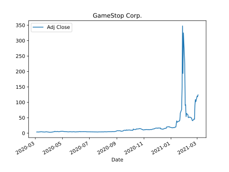
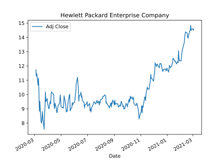
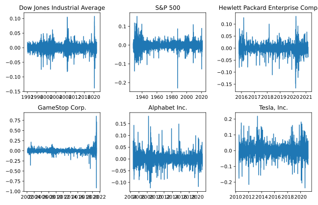
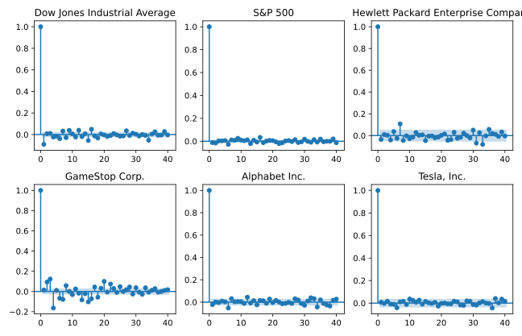

Stock prices
------------

---

Stock prices
------------

---

Stock prices
------------

---

Stock prices
------------

---

The Efficient Market Hypothesis 
-------------------------------

A market in which prices always "*fully reflect*" available information is called "*efficient*".

---

The Efficient Market Hypothesis 
-------------------------------

$$E\left[P_{t+1}|\Phi_t\right] = P_t + E\left[r_{t+1}|\Phi_t\right]P_t $$

- $P_t$: Price at time $t$
- $r_t$: Return from $t-1$ to $t$
- $\Phi_t$: The available information at time $t$

---

The Random Walk Hypothesis
--------------------------
$$P_{t} = M + P_{t-1} + r_t $$

- $r_t$ : Is "white noise" (i.i.d., mean *zero*)
- $M$: Is the risk free return

---

The Random Walk Hypothesis
--------------------------

\<Live simulation\>

---

The Random Walk Hypothesis
--------------------------

---

The Random Walk Hypothesis
--------------------------

---

# Pick The Walk!

- [Dry run](http://127.0.0.1:5050/)
- [Real deal](http://127.0.0.1:5000/)

---

# Formal test

---

Dickey-Fuller test
------------------

$$ P_{t} = M + a P_{t-1} + r_t $$

Test if $a = 1$

----

Survey of securities
------------------
10 random securities from:

- Index (e.g. S&P 500)
- ETF's
- Mutual funds ("investeringsforening")
- Stocks
- Currencies

[Results](file:///home/duffau/coding-projects/stock-prices-talk/eff-market-hyp/analysis/dickey_fuller_survey/tables/adf_results.html)

---

Returns
-------

Day-to-day returns are defined as,
$$r_t = \frac{P_t - P_{t-1}}{P_{t-1}}$$

---

Autocorrelation
----------------

---

Autocorrelation
----------------
$$acf_k(P_t) = corr(P_t, P_{t-k})$$

---

Autocorrelation
----------------

---

Autocorrelation
----------------

